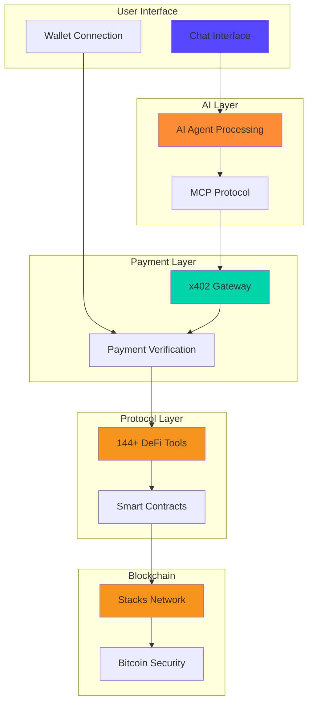

<div align="center">

# The Stacks AI

### **Talk to Bitcoin. Trade, lend, stack — through conversation.**

[](https://www.stacks.co/)
[](https://modelcontextprotocol.io/)
[](#)
[](#)

---

**Making Bitcoin DeFi as simple as conversation.**

We've built the first comprehensive AI interface for Bitcoin DeFi on Stacks Layer 2, bringing natural language access to lending, trading, staking, and governance across the entire ecosystem.

[Explore Docs](https://x402-docs.stacks-ai.app) • [Try Demo](https://x402.stacks-ai.app) • [View Gateway](https://gateway.stacks-ai.app)

</div>

---

## What We're Building

**The Stacks AI** is transforming how people interact with Bitcoin DeFi. Instead of navigating complex interfaces, users simply describe what they want to do. Our AI understands Bitcoin DeFi terminology and executes operations across multiple protocols through a single conversational interface.

```
User: "Swap 100 STX for ALEX on ALEX Protocol"
AI: Executes multi-hop routing, finds best price, returns unsigned transaction
```

### Three Core Products

| Product | Description | Status |
|---------|-------------|--------|
| **Stacks AI Chat** | Natural language interface for Bitcoin DeFi | Live |
| **MCP Server** | 144+ tools across 7 DeFi protocols | Production |
| **stackai-x402** | HTTP 402 payments for AI agent tool calls | Live |

---

## Architecture

<div align="center">



</div>

---

## Key Features

### Comprehensive Protocol Coverage

Access 7 major Bitcoin DeFi protocols through a unified interface:

- **ALEX Protocol** — AMM & Orderbook DEX with multi-hop routing (34 tools)
- **Velar** — Multi-chain Bitcoin L2 DEX (18 tools)
- **BitFlow** — Stable-focused DEX with concentrated liquidity (29 tools)
- **Arkadiko** — Collateralized lending & USDA stablecoin (28 tools)
- **Charisma** — Composable vaults & Blaze intent protocol (14 tools)
- **Granite Finance** — Multi-collateral lending with sBTC (21 tools)
- **Stacks Core** — Contracts, PoX stacking, tokens, NFTs (40+ tools)

### Natural Language DeFi

Transform conversational commands into blockchain operations:

```
"Stack 10,000 STX for Bitcoin rewards"
"Borrow 1000 USDA using STX as collateral"
"Show me all liquidity pools on Velar"
"What's my vault health factor on Arkadiko?"
"Generate a SIP-010 token contract called MyToken"
```

### HTTP 402 Payments

Monetize AI tools with zero intermediaries:

- **Pay-per-call** pricing for MCP tools
- **STX, sBTC, USDCx** payment support
- **Client-side signing** — private keys never leave your device
- **Automatic retry** — transparent 402 payment handling
- **No subscriptions** — pay only for what you use

### Security First

- Client-side wallet integration with Stacks Connect
- No private key storage on servers
- User confirmation required for all write operations
- Network isolation (mainnet/testnet/devnet)
- Transaction status tracking and confirmation

---

## Repositories

### Core Infrastructure

| Repository | Description | Tech Stack |
|------------|-------------|------------|
| [**stacks-frontend**](https://github.com/TheStacksAI/stacks-frontend) | Chat-based UI for Bitcoin DeFi | Next.js 15, React 19, TypeScript, Vercel AI SDK |
| [**stacks-mcp-server**](https://github.com/TheStacksAI/stacks-mcp-server) | MCP server with 144+ DeFi tools | Node.js, TypeScript, Stacks.js, MCP Protocol |
| [**stackai-x402**](https://github.com/TheStacksAI/stackai-x402) | HTTP 402 payment gateway & SDK | TypeScript, Redis, Turbo monorepo |

### Sub-Projects

- **Gateway** — HTTP 402 payment proxy with auth & analytics
- **SDK** — Client library for x402 payment handling
- **Web Dashboard** — Agent marketplace & analytics
- **Moltbook** — Autonomous social agent with content generation
- **OpenAPI-MCP** — Convert any OpenAPI spec to MCP tools
- **Docs** — Comprehensive documentation site

---

## Use Cases

<table>
<tr>
<td width="50%">

### For DeFi Users
- Trade across multiple DEXs with natural language
- Manage lending positions conversationally
- Stack STX for Bitcoin yields via chat
- Track portfolio and positions in plain English
- Deploy smart contracts without coding

</td>
<td width="50%">

### For AI Developers
- Integrate Bitcoin DeFi into AI agents
- Monetize MCP tools with HTTP 402
- Access 144+ production-ready tools
- Build on standardized protocol (MCP)
- Deploy on decentralized infrastructure

</td>
</tr>
</table>

---

## Why Stacks AI?

| Feature | Traditional DeFi | Stacks AI |
|---------|------------------|-----------|
| **Interface** | Complex UI, multiple platforms | Natural language, single chat |
| **Learning Curve** | Weeks of research | Instant, conversational |
| **Protocol Access** | Visit each protocol separately | Unified interface to 7+ protocols |
| **Smart Contracts** | Solidity expertise required | Generate via conversation |
| **AI Integration** | Manual API integration | MCP standard, plug & play |
| **Monetization** | Subscriptions, tokens | Pay-per-call, no intermediaries |

---

## Statistics

<div align="center">

### **144+ Tools** • **7 Protocols** • **3 Networks** • **0 Mocks**

| Metric | Value |
|--------|-------|
| **DeFi Protocols** | ALEX, Velar, BitFlow, Arkadiko, Charisma, Granite, Stacks Core |
| **Total Tools** | 144+ production-ready MCP tools |
| **Networks** | Mainnet, Testnet, Devnet (local) |
| **Tool Categories** | Swaps, Lending, Stacking, NFTs, Contracts, Analytics |
| **Payment Tokens** | STX, sBTC, USDCx |
| **Architecture** | Zero mocks, real protocol integration |

</div>

---

## Quick Start

### For Users

1. **Visit** [x402.stacks-ai.app](https://x402.stacks-ai.app)
2. **Connect** your Stacks wallet (Leather or Xverse)
3. **Start chatting** with Bitcoin DeFi

### For Developers

```bash
# Install SDK
npm install stackai-x402

# Create AI agent client with automatic payment handling
import { createAgentClient, generateAgentWallet } from 'stackai-x402'

const wallet = generateAgentWallet('mainnet')
const client = createAgentClient(wallet.privateKey, 'mainnet')

// Call tools - 402 payments handled automatically
const response = await client.post('https://gateway.stacks-ai.app/mcp', {
  jsonrpc: '2.0',
  method: 'tools/call',
  params: { name: 'swap-tokens', arguments: { amount: 100 } }
})
```

### For Tool Providers

```typescript
import { createAgent } from 'stackai-x402'

// Monetize your MCP tools
const agent = await createAgent('https://gateway.stacks-ai.app', privateKey, {
  name: 'My DeFi Agent',
  description: 'Custom Bitcoin DeFi tools',
  tools: [
    { serverId: 'srv_123', toolName: 'my-tool', price: 0.01 }
  ]
})
```

---

## Technology Stack

<div align="center">

| Layer | Technologies |
|-------|--------------|
| **Frontend** | Next.js 15, React 19, TypeScript, Tailwind CSS, Vercel AI SDK |
| **Backend** | Node.js 20+, Express, Redis, TypeScript |
| **Blockchain** | Stacks.js, Clarity, Hiro API, Bitcoin PoX |
| **AI** | OpenAI GPT, Anthropic Claude, Vercel AI SDK, MCP Protocol |
| **Protocols** | ALEX SDK, Velar SDK, BitFlow SDK, Protocol APIs |
| **Payments** | HTTP 402, Stacks STX, sBTC, USDCx |
| **Database** | Redis, PostgreSQL, Drizzle ORM |
| **DevOps** | Turbo, pnpm, Docker, Vercel, Railway |

</div>

---

## Live Services

| Service | URL | Description |
|---------|-----|-------------|
| **Main App** | [x402.stacks-ai.app](https://x402.stacks-ai.app) | Chat interface for Bitcoin DeFi |
| **Gateway** | [gateway.stacks-ai.app](https://gateway.stacks-ai.app) | HTTP 402 payment proxy |
| **Moltbook** | [moltbook.stacks-ai.app](https://moltbook.stacks-ai.app) | Autonomous social agent |
| **OpenAPI MCP** | [openapi.stacks-ai.app](https://openapi.stacks-ai.app) | OpenAPI to MCP converter |
| **Documentation** | [x402-docs.stacks-ai.app](https://x402-docs.stacks-ai.app) | Full documentation |

---

## Contributing

We welcome contributions from the community! Whether you're:

- Reporting bugs
- Suggesting features
- Improving documentation
- Submitting code
- Writing tests

Check out our repositories and open an issue or PR. All contributions require:

- Tests passing
- TypeScript type safety
- Documentation updates
- Code review approval

---

## Resources

<table>
<tr>
<td>

### Documentation
- [Getting Started Guide](https://x402-docs.stacks-ai.app)
- [MCP Server Docs](https://github.com/TheStacksAI/stacks-mcp-server#readme)
- [x402 SDK Reference](https://github.com/TheStacksAI/stackai-x402#readme)
- [API Documentation](https://gateway.stacks-ai.app/docs)

</td>
<td>

### Links
- [Stacks Blockchain](https://www.stacks.co/)
- [Model Context Protocol](https://modelcontextprotocol.io/)
- [Bitcoin](https://bitcoin.org/)
- [Hiro Platform](https://www.hiro.so/)

</td>
</tr>
</table>

---

## Roadmap

- **Q2 2025** — MCP Server v1.0 with 144+ tools
- **Q3 2025** — stackai-x402 payment protocol
- **Q4 2025** — Chat interface & wallet integration
- **Q1 2026** — Advanced agent marketplace
- **Q2 2026** — Cross-chain protocol expansion
- **Q3 2026** — Mobile applications (iOS/Android)
- **Q4 2026** — Enterprise API & white-label solutions

---

## License

All projects are open source under the **MIT License**. See individual repository LICENSE files for details.

---

## Community & Support

<div align="center">

### Join the conversation

[](https://twitter.com/TheStacksAI)
[](https://discord.gg/stacksai)
[](https://github.com/TheStacksAI)

**Questions? Issues? Ideas?** Open an issue in the relevant repository or join our community channels.

---

### Built by the Stacks AI team

*Making Bitcoin DeFi accessible to everyone, one conversation at a time.*

</div>
